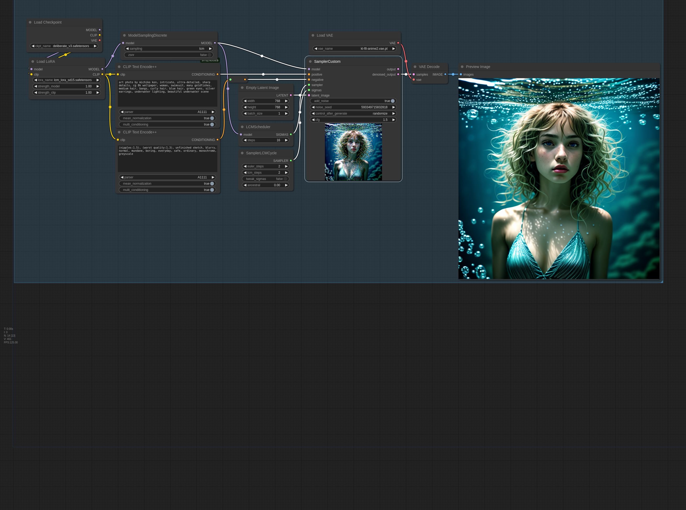

# ComfyUI-sampler-lcm-alternative
ComfyUI Custom Sampler nodes that add a new improved LCM sampler functions

This custom node repository adds three new nodes for ComfyUI to the Custom Sampler category. SamplerLCMAlternative, SamplerLCMCycle and LCMScheduler (just to save a few clicks, as you could also use the BasicScheduler and choose smg_uniform).
Just clone it into your custom_nodes folder and you can start using it as soon as you restart ComfyUI.

Update 2024.06.24: I've added a new sampler SamplerLCMDualNoise. I consider the others obsolete now due to how stunnigly well this new sampler works. It achieves great results on SD1.5 (yes, the ORIGINAL!) plus LCM Lora with CFG 1.0 and only positive prompt.

SamplerLCMDualNoise has one extra parameter.
- `weight`, this sampler simultaneously samples with Euler and LCM on every step. This parameter controls the weight each of them is given for the results. 0.0 results in a result that's identical with the original LCM sampler. 1.0 is identical to Euler.
  I've experimentally found that weights between 0.66 and 0.95 seem to work best. The best weight depends on the number of steps and might also be affected by the prompt, CFG and other parameters. Consider these as rough starting points: 50 steps -> weight 0.95, 4 steps -> weight 0.66, 16 steps -> weight 0.8

SamplerLCMAlternative has two extra parameters.
- `euler_steps`, which tells the sampler to use Euler sampling for the first n steps (or skip euler only for last n steps if n is negative).
- `ancestral`, If you give this a value above 0.0, the Euler steps get some fresh randomness injected each step. The value controls how much.

With default parameters, this sampler acts exactly like the original LCM sampler from ComfyUI. When you start tuning, I recommend starting by setting `euler_steps` to half of the total step count this sampler will be handling. going higher will increase details/sharpness and lower will decrease both.

SamplerLCMCycle has three extra parameters. This sampler repeats a cycle of Euler and LCM sampling steps until inference is done.
If you're doing txt2img with LCM and feel like LCM is giving boring or artificial looking images, give this sampler a try.
- `euler_steps`, sets the number of euler steps per cycle
- `lcm_steps`, sets the number of lcm steps per cycle
- `ancestral`, same as with SamplerLCMAlternative

The default settings should work fine. I recommend using at least 6 steps to allow for 2 full cycles, that said, this sampler seems to really benefit from extra steps.

**I also higly recommend using the `RescaleCFG` node when using LCM Lora. With that, you can bump CFG up to 3.0 and sometimes even higher, which really helps quality and the effectiveness of negative prompt.**

Here's an example workflow for how to use SamplerLCMCycle:

